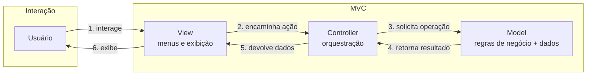
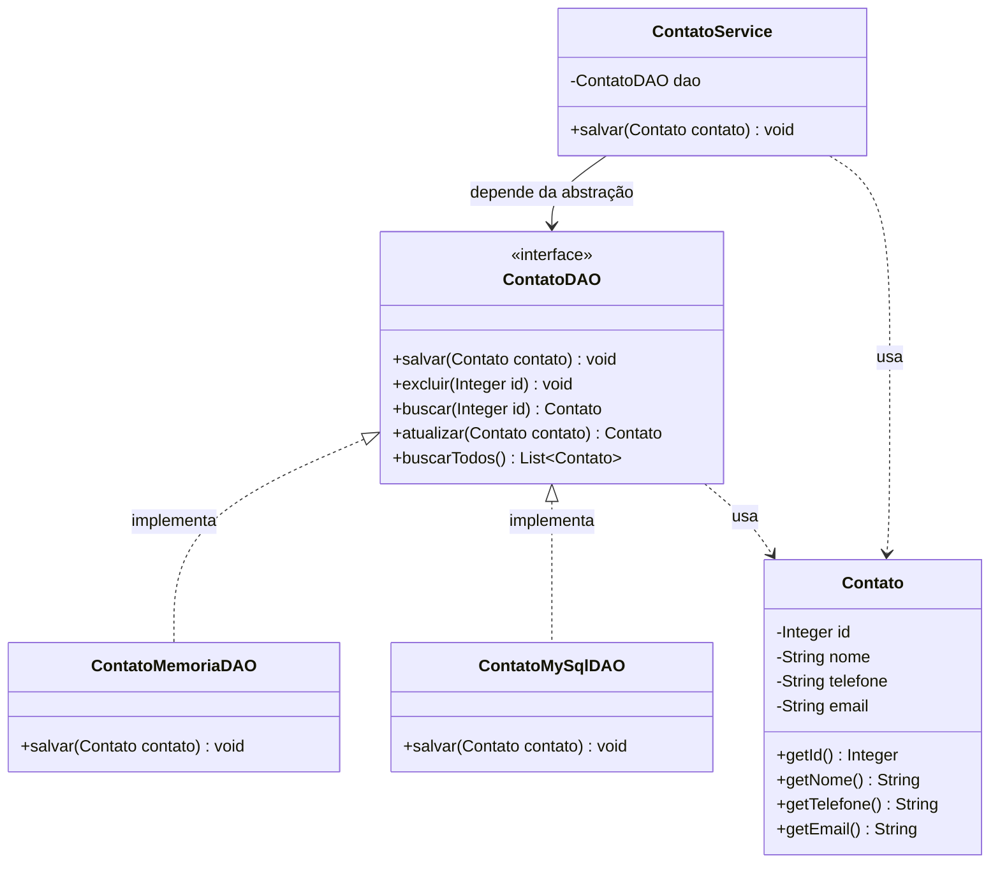
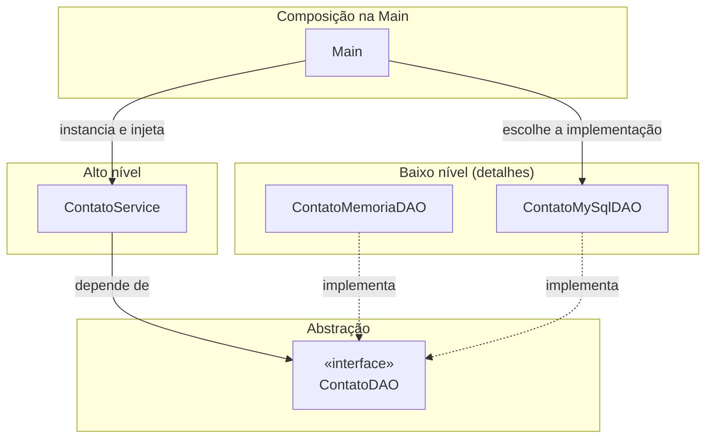
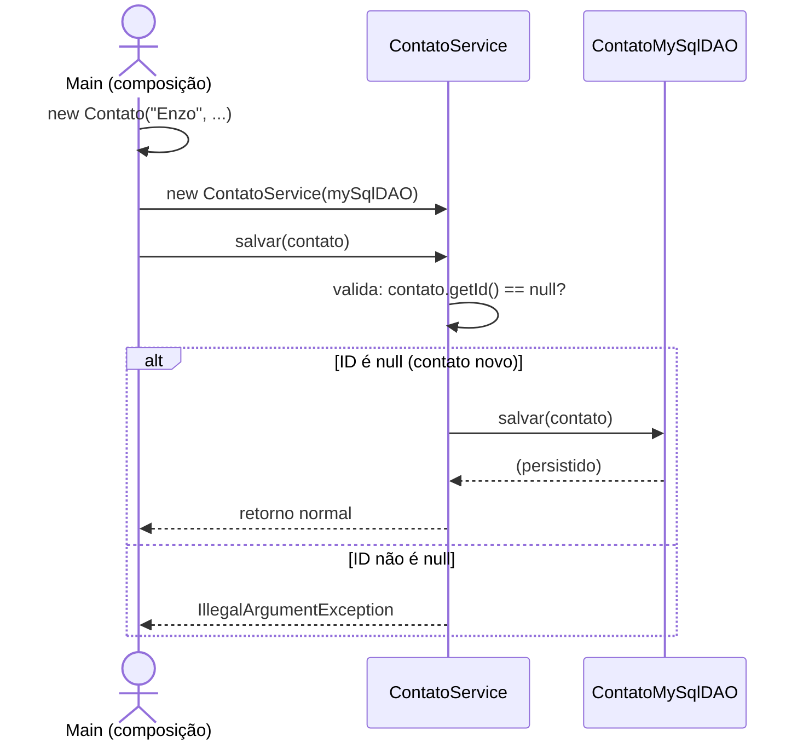

# MVC Playground — Agenda de Contatos (Console)

Projeto didático em Java (console) para o estudo do padrão arquitetural **MVC (Model-View-Controller)** e dos padrões de projeto aplicados na camada **Model**: Entidade, DAO/Repository, Service, Inversão de Dependência e Polimorfismo.

Este repositório evolui a cada aula. Consulte o [Roadmap](#-roadmap--próximos-passos) para ver o que já foi coberto e o que vem a seguir.

## O que é MVC?

**MVC (Model-View-Controller)** é um padrão arquitetural que organiza a aplicação em **três camadas com responsabilidades distintas**, de forma que cada parte do código tenha **um único motivo para mudar**. O objetivo central é a **separação de conceitos** (*separation of concerns*): a regra de negócio não deve depender de como os dados são exibidos, nem de onde eles são persistidos.

### As três camadas

| Camada | Responsabilidade | O que NÃO deve fazer |
|---|---|---|
| **Model** | Contém o **estado** (dados) e as **regras de negócio** da aplicação. É o coração do sistema: entidades, serviços, validações e persistência. | Saber qualquer coisa sobre telas, menus, `System.out` de interação com usuário ou formato de exibição. |
| **View** | **Apresenta** os dados ao usuário e **captura** suas entradas. Em uma aplicação console: menus, prompts, formatação da saída. | Tomar decisões de negócio ou acessar persistência diretamente. |
| **Controller** | **Intermediário** entre View e Model. Recebe as ações do usuário vindas da View, invoca os serviços do Model e devolve o resultado para a View exibir. | Conter regras de negócio (isso é do Model) ou formatar saída (isso é da View). |

### Fluxo MVC



**Leitura do fluxo:** o usuário nunca fala com o Model diretamente. A View captura a intenção, o Controller traduz essa intenção em chamadas ao Model, e o resultado percorre o caminho de volta até ser exibido.

### Por que separar?

1. **Testabilidade** — a regra de negócio pode ser testada sem interface nenhuma.
2. **Manutenibilidade** — trocar a interface (console → web, por exemplo) não toca no Model.
3. **Evolução independente** — cada camada pode evoluir sem quebrar as demais, desde que os contratos (interfaces) sejam respeitados.

---

## Estrutura do projeto

```text
src/
├── Main.java                      ← ponto de entrada (composição das dependências)
├── controller/                    ← camada Controller (em breve)
├── view/                          ← camada View (em breve)
└── model/                         ← camada Model
    ├── Contato.java               ← Entidade
    ├── ContatoDAO.java            ← Interface (contrato) do repositório
    ├── impl/
    │   ├── ContatoMemoriaDAO.java ← Implementação em memória
    │   └── ContatoMySqlDAO.java   ← Implementação para MySQL
    └── services/
        └── ContatoService.java    ← Regras de negócio
```

> **Estado atual:** apenas a camada **Model** está implementada. As camadas Controller e View serão construídas nas próximas aulas (ver [Roadmap](#-roadmap--próximos-passos)).

---

## A camada Model em detalhe

A camada Model não é uma classe única — ela é composta por **vários papéis**, cada um resolvendo um problema específico. A seguir, os patterns presentes no nosso Model.

### Entidade (Entity)

A **Entidade** representa um conceito do domínio com **identidade própria** e ciclo de vida. Dois contatos com os mesmos dados, mas IDs diferentes, são objetos de domínio diferentes.

```java
// model/Contato.java
public class Contato {
    private Integer id;
    private String nome;
    private String telefone;
    private String email;
    // ...
}
```

Pontos importantes na nossa entidade:

- **Identidade (`id`)** — é o que distingue uma entidade de outra. O `id` começa `null` e só é atribuído quando o contato é persistido (quem gera o ID é o mecanismo de persistência, não a aplicação).
- **`equals` e `hashCode`** — implementados com base em `id` e `email`. Isso define **o que significa "ser o mesmo contato"** para o sistema e permite usar a entidade corretamente em coleções (`Set`, `Map`).

> **Entidade vs. Value Object (VO):** uma Entidade tem identidade e muda ao longo do tempo; um Value Object é definido apenas pelos seus atributos e é imutável (ex.: um `Endereco` — dois endereços iguais são intercambiáveis). Em breve veremos VOs no projeto.

### Repository / DAO

O **DAO (Data Access Object)** — também chamado de **Repository** — é o pattern que **isola o acesso à persistência**. O restante da aplicação não sabe (e não deve saber) se os dados vivem em memória, em um banco MySQL, em arquivo ou numa API remota.

No nosso projeto, o DAO é uma **interface**:

```java
// model/ContatoDAO.java
public interface ContatoDAO {
    void salvar(Contato contato);
    void excluir(Integer id);
    Contato buscar(Integer id);
    Contato atualizar(Contato contato);
    List<Contato> buscarTodos();
}
```

A interface define o **contrato**: as operações CRUD (*Create, Read, Update, Delete*) que qualquer mecanismo de persistência de contatos deve oferecer.

### Implementações do DAO

O contrato `ContatoDAO` tem **duas implementações** no projeto:

```java
// model/impl/ContatoMemoriaDAO.java
public class ContatoMemoriaDAO implements ContatoDAO {
    @Override
    public void salvar(Contato contato) {
        System.out.println("Salvando contato na memória: " + contato);
    }
    // ...
}
```

```java
// model/impl/ContatoMySqlDAO.java
public class ContatoMySqlDAO implements ContatoDAO {
    @Override
    public void salvar(Contato contato) {
        System.out.println("Salvando contato no MySQL: " + contato);
    }
    // ...
}
```

Este é o **polimorfismo** em ação: duas classes diferentes respondem às **mesmas mensagens** (os métodos da interface), cada uma do seu jeito. Hoje elas apenas simulam a persistência com `println` — nas próximas aulas a implementação MySQL ganhará JDBC de verdade.

### Service

O **Service** concentra as **regras de negócio** — decisões que não pertencem nem à entidade (que é só estado) nem ao DAO (que é só persistência).

```java
// model/services/ContatoService.java
public class ContatoService {
    private final ContatoDAO dao;

    public ContatoService(ContatoDAO dao) {   // ← injeção de dependência
        this.dao = dao;
    }

    public void salvar(Contato contato) {
        if (contato.getId() != null) {
            throw new IllegalArgumentException("O ID do contato deve ser maior que zero.");
        }
        dao.salvar(contato);
    }
}
```

Observe dois detalhes fundamentais:

1. **A regra de negócio vive aqui:** ao salvar, o contato deve ser *novo* (`id == null`). Se o `id` já existe, é uma atualização — operação diferente, com regras diferentes.
2. **O Service depende da abstração `ContatoDAO`, não de uma implementação concreta.** Este é o assunto da próxima seção.

### Diagrama de classes (UML) do Model



---

## Inversão de Dependência e Polimorfismo

### O problema: dependência de implementação

Imagine se o `ContatoService` fosse escrito assim:

```java
// ANTI-PADRÃO — não faça isso!
public class ContatoService {
    private final ContatoMySqlDAO dao = new ContatoMySqlDAO();
    // ...
}
```

O Service ficaria **acoplado** ao MySQL. Para trocar a persistência (por exemplo, usar memória nos testes), seria preciso **alterar o código do Service** — e toda mudança de implementação geraria mudança na regra de negócio. Camadas que deveriam ser independentes passam a mudar juntas.

### A solução: Inversão de Dependência (DIP)

O **Princípio da Inversão de Dependência** (o "D" do SOLID) diz:

> Módulos de alto nível não devem depender de módulos de baixo nível. **Ambos devem depender de abstrações.**

No nosso código:

- **Módulo de alto nível:** `ContatoService` (regra de negócio — "o quê")
- **Módulo de baixo nível:** `ContatoMySqlDAO` (detalhe técnico — "como")
- **Abstração:** a interface `ContatoDAO`

O Service declara sua dependência pela **abstração** e a recebe **pronta pelo construtor** — isso é **Injeção de Dependência (DI)**:

```java
private final ContatoDAO dao;

public ContatoService(ContatoDAO dao) {
    this.dao = dao;
}
```

### Onde o polimorfismo entra

Como o Service conhece apenas a interface, **qualquer implementação** de `ContatoDAO` pode ser injetada. A escolha acontece **na composição da aplicação** (hoje, na `Main`):

```java
// src/Main.java
ContatoMySqlDAO mySqlDAO = new ContatoMySqlDAO();
ContatoService service = new ContatoService(mySqlDAO);
service.salvar(contato);   // → "Salvando contato no MySQL: ..."
```

Trocar de banco para memória **não exige tocar em nenhuma linha do Service**:

```java
ContatoService service = new ContatoService(new ContatoMemoriaDAO());
service.salvar(contato);   // → "Salvando contato na memória: ..."
```



A seta de dependência do Service aponta para a **abstração**, nunca para as implementações. É por isso que dizemos que a dependência foi **invertida**: sem a interface, o fluxo natural de dependência seria `Service → MySqlDAO` (alto nível → baixo nível).

---

## Tutorial: reproduzindo o código atual

Siga os passos na ordem para reconstruir o projeto do zero.

### Passo 1 — A Entidade

Crie `src/model/Contato.java`. Começamos pelo conceito de domínio: um contato tem nome, telefone e e-mail, e ganha um `id` ao ser persistido.

```java
package model;

import java.util.Objects;

public class Contato {
    private Integer id;
    private String nome;
    private String telefone;
    private String email;

    public Contato(String nome, String telefone, String email) {
        this.nome = nome;
        this.telefone = telefone;
        this.email = email;
    }

    public Integer getId() { return id; }
    public void setId(Integer id) { this.id = id; }

    public String getNome() { return nome; }
    public void setNome(String nome) { this.nome = nome; }

    public String getTelefone() { return telefone; }
    public void setTelefone(String telefone) { this.telefone = telefone; }

    public String getEmail() { return email; }
    public void setEmail(String email) { this.email = email; }

    @Override
    public boolean equals(Object o) {
        if (o == null || getClass() != o.getClass()) return false;
        Contato contato = (Contato) o;
        return Objects.equals(id, contato.id) && Objects.equals(email, contato.email);
    }

    @Override
    public int hashCode() {
        return Objects.hash(id, email);
    }

    @Override
    public String toString() {
        return "Contato{" +
                "id=" + id +
                ", nome='" + nome + '\'' +
                ", telefone='" + telefone + '\'' +
                ", email='" + email + '\'' +
                '}';
    }
}
```

**Discussão em sala:** por que `id` e `email` no `equals`/`hashCode`? O que aconteceria se usássemos `nome`?

### Passo 2 — O contrato do repositório (Interface DAO)

Crie `src/model/ContatoDAO.java`. Definimos **o que** pode ser feito com contatos na persistência, sem dizer **como**.

```java
package model;

import model.domain.Contato;

import java.util.List;

public interface ContatoDAO {
    void salvar(Contato contato);

    void excluir(Integer id);

    Contato buscar(Integer id);

    Contato atualizar(Contato contato);

    List<Contato> buscarTodos();
}
```

**Discussão em sala:** por que uma interface e não uma classe? Que liberdade ganhamos ao programar contra um contrato?

### Passo 3 — As implementações (polimorfismo)

Crie `src/model/impl/ContatoMemoriaDAO.java` e `src/model/impl/ContatoMySqlDAO.java`. Duas estratégias de persistência, o mesmo contrato.

```java
package model.daos.impl;

import model.domain.Contato;

import java.util.List;

public class ContatoMemoriaDAO implements model.daos.ContatoDAO {
    @Override
    public void salvar(Contato contato) {
        System.out.println("Salvando contato na memória: " + contato);
    }

    @Override
    public void excluir(Integer id) {
    }

    @Override
    public Contato buscar(Integer id) {
        return null;
    }

    @Override
    public Contato atualizar(model.domain.Contato contato) {
        return null;
    }

    @Override
    public List<Contato> buscarTodos() {
        return List.of();
    }
}
```

```java
package model.daos.impl;

import model.domain.Contato;
import model.daos.ContatoDAO;

import java.util.List;

public class ContatoMySqlDAO implements ContatoDAO {
    @Override
    public void salvar(Contato contato) {
        System.out.println("Salvando contato no MySQL: " + contato);
    }

    @Override
    public void excluir(Integer id) {
    }

    @Override
    public Contato buscar(Integer id) {
        return null;
    }

    @Override
    public Contato atualizar(Contato contato) {
        return null;
    }

    @Override
    public List<Contato> buscarTodos() {
        return List.of();
    }
}
```

**Discussão em sala:** o que a anotação `@Override` garante em tempo de compilação? Por que as duas classes são intercambiáveis para quem usa a interface?

### Passo 4 — O Service com Injeção de Dependência

Crie `src/model/services/ContatoService.java`. Aqui entra a primeira **regra de negócio**: só se salva um contato novo.

```java
package model.services;

import model.domain.Contato;
import model.daos.ContatoDAO;
import model.domain.Contato;

public class ContatoService {
    private final ContatoDAO dao;

    public ContatoService(ContatoDAO dao) {
        this.dao = dao;
    }

    public void salvar(model.domain.Contato contato) {
        if (contato.getId() != null) {
            throw new IllegalArgumentException("O ID do contato deve ser maior que zero.");
        }
        dao.salvar(contato);
    }
}
```

**Discussão em sala:** o Service poderia chamar `new ContatoMySqlDAO()` internamente? O que perderíamos?

### Passo 5 — Compondo tudo na Main

Crie `src/Main.java`. A `Main` é o **ponto de composição**: o único lugar que conhece as implementações concretas e as conecta.

```java
import model.domain.Contato;
import model.daos.impl.ContatoMySqlDAO;
import model.services.ContatoService;

public class Main {
    public static void main(String[] args) {
        Contato contato = new Contato("Enzo", "1234567890", "enzo@me.com");
        ContatoMySqlDAO mySqlDAO = new ContatoMySqlDAO();

        ContatoService service = new ContatoService(mySqlDAO);
        service.salvar(contato);
    }
}
```

Compile e execute (veja [Como executar](#como-executar)). **Experimento:** troque `ContatoMySqlDAO` por `ContatoMemoriaDAO` na linha da composição e rode de novo. O que mudou? O que **não** mudou?

### O fluxo completo: o que acontece ao salvar



---

## Roadmap — Próximos passos

| Etapa | Conteúdo                                                                        | Status |
|---|---------------------------------------------------------------------------------|---|
| 1 | Divisão de conceitos nas camadas MVC                                            | ✅ Concluído |
| 2 | Model: Entidade, DAO/Repository (interface), implementações, Service            | ✅ Concluído |
| 3 | Inversão de Dependência, injeção via construtor e polimorfismo                  | ✅ Concluído |
| 4 | DTOs (Data Transfer Objects) — separar o que entra/sai do que é persistido      | ⬜ Em breve |
| 5 | Validadores dedicados — criar validações do Service                             | ⬜ Em breve |
| 6 | Camada Controller — orquestrar as ações do usuário                              | ⬜ Em breve |
| 7 | Camada View — menus e interação no console                                      | ⬜ Em breve |
| 8 | Persistência real — JDBC no `ContatoMySqlDAO` e coleções no `ContatoMemoriaDAO` | ⬜ Em breve |

> Este README é atualizado a cada etapa concluída. Se você perdeu uma aula, refaça o [Tutorial](#-tutorial-reproduzindo-o-código-atual) e acompanhe pelo roadmap.
